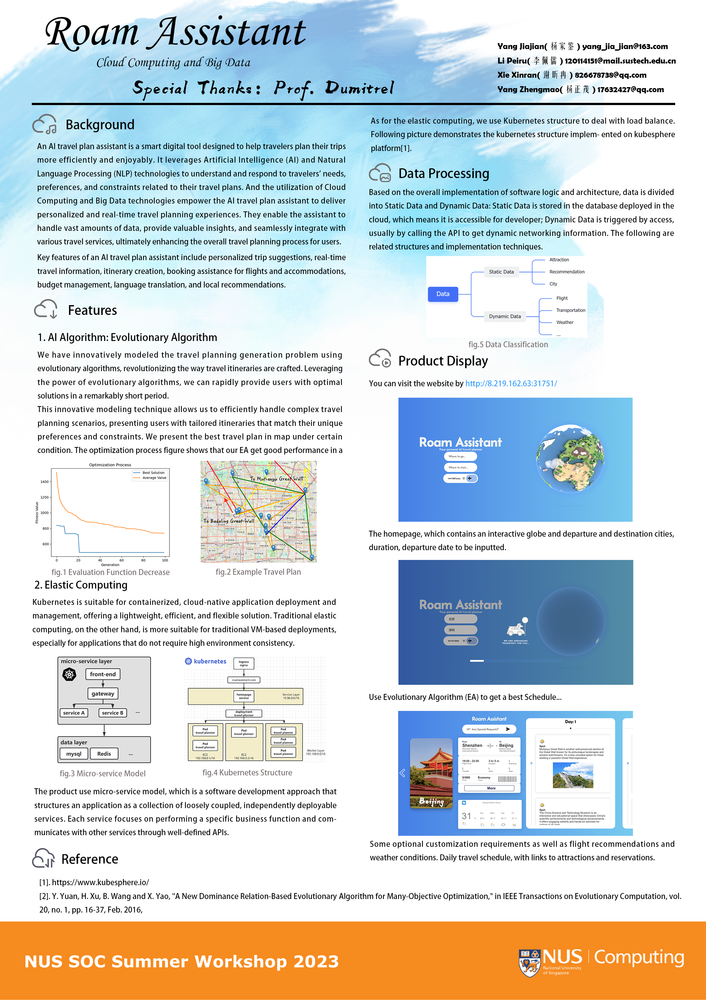

# NUS-SWS3004-project
Team members:

`Yang Jiajian`,`Li Peiru`,`Xie Xinran`,`Yang Zhengmao`
> This is a front-end of Ai Roam Assistant, having commercial level APIs. It has:
> + JWT token login verify.
> + Axios request and response interceptors.
> + Loading page. (Write a component that can be called using JavaScript)
> + Router Guard.
> + HttpRequest encapsulation.
> + Communication between Springboot and Flask.
> + ...

## Poster Presentation


## Backend
see: https://github.com/Vicavier/Roam-Assistant-BackEnd

## Project setup
```
npm install
```

### Compiles and hot-reloads for development
```
npm run serve
```

### Compiles and minifies for production
```
npm run build
```

### Lints and fixes files
```
npm run lint
```

### Customize configuration
See [Configuration Reference](https://cli.vuejs.org/config/).
